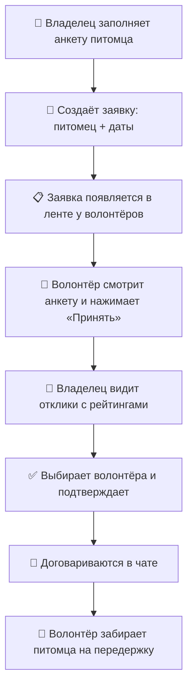

# 🐾 PetNest

> Найдите, с кем оставить питомца

**PetNest** — мобильное приложение, которое помогает найти временную передержку для домашних животных.

Уезжаете в отпуск, командировку или к родственникам, а собаку или кота не с кем оставить? Создайте заявку в PetNest, и **волонтёр** бесплатно заберёт питомца к себе, пока вас нет. 🏡

## 🤔 Зачем это нужно

- 🧳 Владельцу не нужно искать платную гостиницу для животных или уговаривать знакомых
- 💜 Волонтёры, которые любят животных, могут помочь и побыть с питомцем
- ⭐ Рейтинг и отзывы помогают выбрать надёжного человека

## 👥 Роли

| | Кто это | Что делает |
|---|---|---|
| 🧑 **Владелец** | Хозяин питомца, который уезжает | Создаёт заявку и выбирает волонтёра |
| 🙋 **Волонтёр** | Человек, готовый бесплатно приютить животное | Откликается на заявки и забирает питомца |

## 🔄 Как это работает

### По шагам

1. 📲 **Регистрация.** Пользователь выбирает, кто он — владелец или волонтёр, и регистрируется по почте и телефону или через Google / VK.
2. 🐱 **Анкета питомца.** Владелец добавляет питомца: фото, кличку, вид, возраст и особенности ухода — например, «таблетка в 16:00, выгул только на поводке».
3. 📝 **Заявка.** Владелец выбирает питомца и даты, на которые нужна передержка.
4. 📋 **Лента заявок.** Волонтёр видит рекомендуемые заявки: кто, на какие даты и где.
5. 🙋 **Отклик.** Волонтёр открывает анкету питомца и нажимает «Принять».
6. ⭐ **Выбор волонтёра.** Владелец смотрит, кто откликнулся: рейтинг, количество отзывов, каких животных человек берёт, что пишет о себе и что говорят другие владельцы.
7. ✅ **Подтверждение.** Владелец выбирает одного волонтёра и подтверждает его.
8. 💬 **Чат.** Владелец и волонтёр обсуждают детали и договариваются о встрече.
9. 🐶 **Передержка.** Волонтёр забирает питомца и заботится о нём до возвращения хозяина.

## 📱 Экраны

**Для всех**
- 👋 Приветственный экран
- 📲 Регистрация и вход с выбором роли
- 💬 Чат

**Для владельца**
- 📋 Лента своих заявок
- 📝 Создание заявки
- 🐱 Анкета питомца
- 🏠 Профиль со списком питомцев
- 👀 Отклики волонтёров
- 🙋 Профиль волонтёра с отзывами

**Для волонтёра**
- 📋 Лента рекомендуемых заявок
- 🐱 Анкета питомца из заявки
- ⭐ Свой профиль с рейтингом и отзывами

## 🛠 Стек

- 📱 **Android** — Kotlin, Jetpack Compose
- ⚙️ **Backend** — Kotlin, Ktor
- 🗄 **База данных** — PostgreSQL

---

🎓 Учебный проект КГУ
